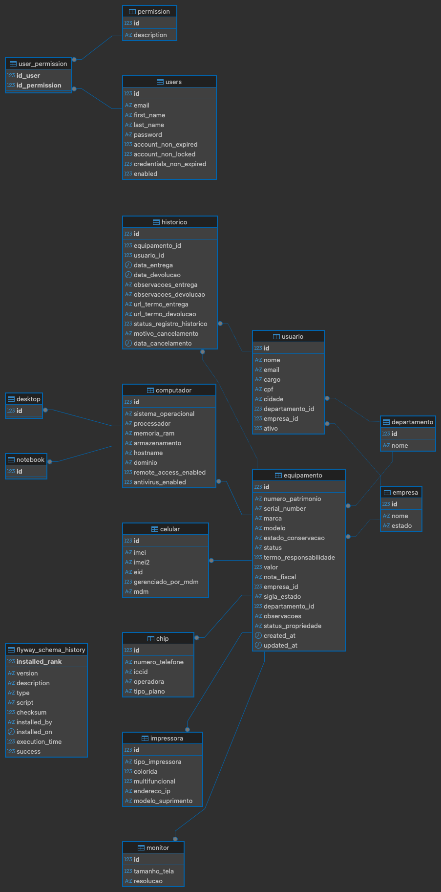

# Cosmo - Gerenciador de Inventário de TI

> 🚧 **Atenção:** Este projeto está em desenvolvimento ativo. Funcionalidades e estruturas podem ser alteradas.

## Sobre o Projeto

**Cosmo** é um sistema web para gerenciamento de inventários de ativos de TI, oferecendo uma plataforma centralizada para cadastrar, rastrear e gerenciar o ciclo de vida de equipamentos como desktops, notebooks, celulares, impressoras e monitores.

O sistema controla o inventário físico e as movimentações dos equipamentos, associando cada ativo a um usuário e mantendo histórico detalhado de entregas, devoluções e cancelamentos.

### ✨ Principais Funcionalidades

- **Gestão Completa de Ativos**: Cadastro e controle de diversos tipos de equipamentos
- **Sistema de Herança**: Arquitetura orientada a objetos com subclasses específicas para cada equipamento
- **Controle de Movimentação**: Histórico completo de entregas e devoluções
- **Auditoria Imutável**: Registros preservados através de cancelamento em vez de exclusão
- **Validações Inteligentes**: Controle automático de campos únicos e integridade de dados
- **Autenticação JWT**: Sistema seguro de autenticação com tokens de acesso e renovação
- **Paginação e Filtros**: Sistema avançado de filtragem usando JPA Specifications
- **Documentação Swagger**: Interface interativa para explorar e testar a API

## Tecnologias Utilizadas

### Backend
* **Java 21**
* **Spring Boot 3.x**
* **Spring Web** - APIs RESTful
* **Spring Data JPA** - Persistência de dados
* **Spring Security** - Autenticação e autorização
* **Spring HATEOAS** - Links de navegação hipermídia
* **JWT (JSON Web Token)** - Autenticação stateless
* **BCrypt** - Hash seguro de senhas
* **JPA Specifications** - Filtragem dinâmica e segura
* **MySQL** - Banco de dados relacional
* **Flyway** - Controle de versão do banco de dados
* **Lombok** - Redução de código boilerplate
* **Swagger/OpenAPI 3** - Documentação interativa da API



### Pré-requisitos

- **Java 21** ou superior
- **Maven 3.6+**
- **MySQL 8.0+**
- **Docker**

### Instalação e Configuração

1. Clone o repositório:
   ```bash
   git clone https://github.com/ClarkAshida/cosmo-backend
    cd cosmo-backend
    ```
   
2. Crie um arquivo `.env` na raiz do projeto com as variáveis de ambiente:
    ```env
    # Variáveis do Banco de Dados MySQL
    MYSQL_DATABASE=cosmo
    MYSQL_USER=root
    MYSQL_ROOT_PASSWORD=root
    
    # Variáveis do Token JWT
    JWT_SECRET_KEY=53cr3t
   
3. Build e Run com Docker:
   ```bash
   docker-compose up --build
   ```
   
4. Acesse a aplicação:

    - API: `http://localhost:8080/api`
    - Swagger UI: `http://localhost:8080/swagger-ui.html`
    - MySQL: `localhost:3306`

5. Comandos Úteis:
    - Parar containers: `docker-compose down`
    - Acessar container MySQL: `docker exec -it cosmo-mysql mysql -u root -p`
    - Acessar container Backend: `docker exec -it cosmo-backend bash`
    - Ver logs de todos os serviços: `docker-compose logs -f`
    - Ver logs apenas da API: `docker-compose logs -f cosmo-api`

## Documentação da API

A API RESTful do Cosmo oferece endpoints modernos com JSON, CORS habilitado, paginação e autenticação JWT.

### 🔐 **Autenticação** - `/api/auth`
| Método | Rota | Descrição |
|--------|------|-----------|
| `POST` | `/api/auth/signin` | Realizar login e obter tokens JWT |
| `PUT` | `/api/auth/refresh/{email}` | Renovar token de acesso |

### 👥 **Administração de Usuários** - `/api/users`
| Método | Rota | Descrição |
|--------|------|-----------|
| `GET` | `/api/users` | Listar usuários do sistema |
| `GET` | `/api/users/{id}` | Buscar usuário por ID |
| `POST` | `/api/users` | Criar novo usuário de sistema |
| `PUT` | `/api/users/{id}` | Atualizar usuário |
| `DELETE` | `/api/users/{id}` | Excluir usuário |
| `GET` | `/api/users/filtrar` | Filtrar usuários |

### 🏢 **Empresas** - `/api/empresas`
| Método | Rota | Descrição |
|--------|------|-----------|
| `GET` | `/api/empresas` | Listar empresas |
| `GET` | `/api/empresas/{id}` | Buscar empresa por ID |
| `POST` | `/api/empresas` | Criar nova empresa |
| `PUT` | `/api/empresas/{id}` | Atualizar empresa |
| `DELETE` | `/api/empresas/{id}` | Excluir empresa |
| `GET` | `/api/empresas/filtrar` | Filtrar empresas |

### 🏛️ **Departamentos** - `/api/departamentos`
| Método | Rota | Descrição |
|--------|------|-----------|
| `GET` | `/api/departamentos` | Listar departamentos |
| `GET` | `/api/departamentos/{id}` | Buscar departamento por ID |
| `POST` | `/api/departamentos` | Criar novo departamento |
| `PUT` | `/api/departamentos/{id}` | Atualizar departamento |
| `DELETE` | `/api/departamentos/{id}` | Excluir departamento |
| `GET` | `/api/departamentos/filtrar` | Filtrar departamentos |

### 👤 **Usuários** - `/api/usuarios`
| Método | Rota | Descrição |
|--------|------|-----------|
| `GET` | `/api/usuarios` | Listar colaboradores |
| `GET` | `/api/usuarios/{id}` | Buscar colaborador por ID |
| `POST` | `/api/usuarios` | Criar novo colaborador |
| `PUT` | `/api/usuarios/{id}` | Atualizar colaborador |
| `DELETE` | `/api/usuarios/{id}` | Desativar colaborador (soft delete) |
| `PUT` | `/api/usuarios/{id}/reativar` | Reativar colaborador |
| `GET` | `/api/usuarios/filtrar` | Filtrar colaboradores |

### 💻 **Equipamentos** - `/api/equipamentos`

#### Consultas Gerais
| Método | Rota | Descrição |
|--------|------|-----------|
| `GET` | `/api/equipamentos` | Listar todos os equipamentos |
| `GET` | `/api/equipamentos/{id}` | Buscar equipamento por ID |
| `GET` | `/api/equipamentos/tipo/{tipo}` | Listar por tipo |
| `GET` | `/api/equipamentos/tipo/{tipo}/count` | Contar por tipo |
| `DELETE` | `/api/equipamentos/{id}` | Excluir equipamento |
| `GET` | `/api/equipamentos/filtrar` | Filtrar equipamentos |

#### Criação por Tipo Específico
| Método | Rota | Tipo |
|--------|------|------|
| `POST` | `/api/equipamentos/notebook` | Notebook |
| `POST` | `/api/equipamentos/desktop` | Desktop |
| `POST` | `/api/equipamentos/celular` | Celular |
| `POST` | `/api/equipamentos/chip` | Chip |
| `POST` | `/api/equipamentos/impressora` | Impressora |
| `POST` | `/api/equipamentos/monitor` | Monitor |

#### Atualização por Tipo Específico
| Método | Rota | Tipo |
|--------|------|------|
| `PUT` | `/api/equipamentos/notebook/{id}` | Notebook |
| `PUT` | `/api/equipamentos/desktop/{id}` | Desktop |
| `PUT` | `/api/equipamentos/celular/{id}` | Celular |
| `PUT` | `/api/equipamentos/chip/{id}` | Chip |
| `PUT` | `/api/equipamentos/impressora/{id}` | Impressora |
| `PUT` | `/api/equipamentos/monitor/{id}` | Monitor |

### 📝 **Histórico** - `/api/historicos`

#### CRUD Básico
| Método | Rota | Descrição |
|--------|------|-----------|
| `GET` | `/api/historicos` | Listar históricos |
| `GET` | `/api/historicos/{id}` | Buscar histórico por ID |
| `PATCH` | `/api/historicos/{id}` | Editar observações |
| `PATCH` | `/api/historicos/{id}/cancelar` | Cancelar histórico |

#### Operações de Negócio
| Método | Rota | Descrição |
|--------|------|-----------|
| `POST` | `/api/historicos/entregar` | Entregar equipamento |
| `PATCH` | `/api/historicos/{id}/devolver` | Devolver equipamento |
| `POST` | `/api/historicos/entregar-multiplos` | Entrega múltipla |
| `PATCH` | `/api/historicos/devolver-multiplos` | Devolução múltipla |

#### Consultas Específicas
| Método | Rota | Descrição |
|--------|------|-----------|
| `GET` | `/api/historicos/usuario/{id}` | Históricos por usuário |
| `GET` | `/api/historicos/equipamento/{id}` | Históricos por equipamento |
| `GET` | `/api/historicos/equipamento/{id}/em-uso` | Verificar se em uso |
| `GET` | `/api/historicos/equipamento/{id}/ativo` | Histórico ativo |
| `GET` | `/api/historicos/filtrar` | Filtrar históricos |

## Status do Projeto

### ✅ Funcionalidades Implementadas
- [x] **CRUD Completo** - Todas as entidades com operações básicas
- [x] **Autenticação JWT** - Login, logout e renovação de tokens
- [x] **Autorização** - Controle de acesso baseado em roles
- [x] **Validações de Negócio** - Campos únicos e integridade referencial
- [x] **Histórico de Movimentação** - Controle completo de entregas/devoluções
- [x] **Paginação** - Sistema completo com metadados
- [x] **Filtros Dinâmicos** - JPA Specifications para busca avançada
- [x] **Tratamento de Erros** - Mensagens estruturadas e códigos HTTP apropriados
- [x] **HATEOAS** - Links de navegação em respostas da API
- [x] **Swagger/OpenAPI** - Documentação interativa da API
- [x] **Flyway** - Gerenciamento de migrações do banco de dados
- [x] **Dockerização** - Criação de imagens Docker para deploy

### 🚧 Próximos Passos
- [ ] **Testes** - Cobertura completa de testes unitários e de integração
- [ ] **Importação/Exportação** - Funcionalidades para CSV/Excel
- [ ] **Monitoramento** - Integração com ferramentas de observabilidade
- [ ] **Frontend** - Desenvolvimento da interface web
- [ ] **Deploy na Cloud** - Pipeline CI/CD automatizado

### 🎯 Melhorias Futuras
- [ ] **Cache** - Implementação de cache para consultas frequentes
- [ ] **Auditoria Avançada** - Log detalhado de todas as operações
- [ ] **Backup Automático** - Sistema de backup e recuperação
- [ ] **API Rate Limiting** - Controle de taxa de requisições

### Colaboração

Contribuições são bem-vindas! Sinta-se à vontade para abrir issues e pull requests.

## Licença

Este projeto é licenciado sob a Licença Apache, Versão 2.0. Veja o arquivo [LICENSE](LICENSE) para mais detalhes.

---

**Cosmo** - Simplificando a gestão de ativos de TI 🚀
