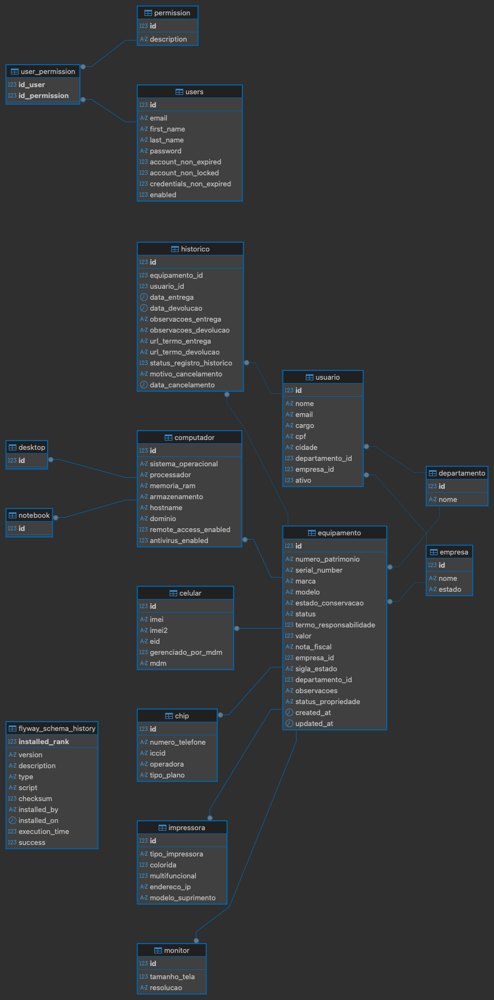

# Cosmo - Gerenciador de Inventário de TI

> 🚧 **Atenção:** Este projeto e sua documentação estão em desenvolvimento ativo. Funcionalidades e estruturas podem ser alteradas. 🚧

## Sobre o Projeto

**Cosmo** é um sistema web desenvolvido para simplificar o gerenciamento de inventários de ativos de TI. O objetivo do projeto é fornecer uma plataforma centralizada para cadastrar, rastrear e gerenciar o ciclo de vida de equipamentos como desktops, notebooks, celulares, impressoras, entre outros.

O sistema controla não apenas o inventário físico, mas também as movimentações desses equipamentos, associando cada ativo a um usuário e mantendo um histórico detalhado e seguro de todas as entregas, devoluções e cancelamentos.

### ✨ Principais Funcionalidades

- **Gestão Completa de Ativos**: Cadastro e controle de diversos tipos de equipamentos
- **Sistema de Herança**: Arquitetura orientada a objetos com subclasses específicas para cada tipo de equipamento
- **Controle de Movimentação**: Histórico completo de entregas e devoluções
- **Auditoria Imutável**: Registros de histórico preservados através de cancelamento em vez de exclusão
- **Validações Inteligentes**: Controle automático de campos únicos e integridade de dados
- **🔗 HATEOAS**: Links de navegação automáticos para descoberta de API
- **📄 Paginação**: Sistema completo de paginação com metadados e navegação
- **🎯 Filtros Dinâmicos**: Sistema avançado de filtragem usando JPA Specifications
- **📊 Ordenação Flexível**: Ordenação por qualquer campo com direção ascendente/descendente

## Tecnologias Utilizadas

O backend do Cosmo é construído com as seguintes tecnologias:

* **Java 21**
* **Spring Boot 3.x**
* **Spring Web:** Para a construção de APIs RESTful.
* **Spring Data JPA:** Para a persistência de dados e comunicação com o banco.
* **Spring HATEOAS:** Para implementação de links de navegação hipermídia.
* **JPA Specifications:** Para filtragem dinâmica e segura de dados.
* **MySQL:** Banco de dados relacional para armazenamento dos dados.
* **Lombok:** Para reduzir código boilerplate em classes Java.
* **Flyway:** Para controle de versão do banco de dados.

> A implementação de segurança com **Spring Security** está planejada para futuras atualizações.

## Documentação da API

A API RESTful do Cosmo oferece endpoints modernos e específicos por tipo de equipamento. Todas as rotas utilizam JSON como formato de dados, possuem CORS habilitado, suportam paginação e incluem links HATEOAS.

### 🏢 **Empresas** - `/api/empresas`
| Método | Rota | Descrição |
|--------|------|-----------|
| `GET` | `/api/empresas` | Lista todas as empresas com paginação |
| `GET` | `/api/empresas/{id}` | Busca uma empresa específica por ID |
| `POST` | `/api/empresas` | Cadastra uma nova empresa |
| `PUT` | `/api/empresas/{id}` | Atualiza dados de uma empresa existente |
| `DELETE` | `/api/empresas/{id}` | Remove uma empresa do sistema |
| `GET` | `/api/empresas/filtrar` | **🔍 Filtra empresas por critérios** |

### 🏛️ **Departamentos** - `/api/departamentos`
| Método | Rota | Descrição |
|--------|------|-----------|
| `GET` | `/api/departamentos` | Lista todos os departamentos com paginação |
| `GET` | `/api/departamentos/{id}` | Busca um departamento específico por ID |
| `POST` | `/api/departamentos` | Cadastra um novo departamento |
| `PUT` | `/api/departamentos/{id}` | Atualiza dados de um departamento |
| `DELETE` | `/api/departamentos/{id}` | Remove um departamento do sistema |
| `GET` | `/api/departamentos/filtrar` | **🔍 Filtra departamentos por critérios** |

### 👤 **Usuários** - `/api/usuarios`
| Método | Rota | Descrição |
|--------|------|-----------|
| `GET` | `/api/usuarios` | Lista todos os usuários com paginação |
| `GET` | `/api/usuarios/{id}` | Busca um usuário específico por ID |
| `POST` | `/api/usuarios` | Cadastra um novo usuário |
| `PUT` | `/api/usuarios/{id}` | Atualiza dados de um usuário |
| `DELETE` | `/api/usuarios/{id}` | **Desativa** um usuário (soft delete) |
| `PATCH` | `/api/usuarios/{id}/reativar` | Reativa um usuário previamente desativado |
| `GET` | `/api/usuarios/filtrar` | **🔍 Filtra usuários por critérios** |

> **Nota:** O delete de usuários é um "soft delete" - apenas marca o usuário como inativo, preservando os dados no banco.

### 💻 **Equipamentos** - `/api/equipamentos`

#### **📋 Consultas Gerais**
| Método | Rota | Descrição |
|--------|------|-----------|
| `GET` | `/api/equipamentos` | Lista todos os equipamentos com paginação |
| `GET` | `/api/equipamentos/{id}` | Busca um equipamento específico por ID |
| `GET` | `/api/equipamentos/tipo/{tipo}` | Lista equipamentos por tipo com paginação |
| `GET` | `/api/equipamentos/tipo/{tipo}/count` | Conta equipamentos por tipo |
| `DELETE` | `/api/equipamentos/{id}` | Remove um equipamento do sistema |
| `GET` | `/api/equipamentos/filtrar` | **🔍 Filtra equipamentos por múltiplos critérios** |

#### **📱 Criação por Tipo Específico (POST)**
| Método | Rota | Descrição | Campos Específicos |
|--------|------|-----------|-------------------|
| `POST` | `/api/equipamentos/notebook` | Cadastra um novo notebook | Sistema, processador, RAM, hostname, etc. |
| `POST` | `/api/equipamentos/desktop` | Cadastra um novo desktop | Sistema, processador, RAM, hostname, etc. |
| `POST` | `/api/equipamentos/celular` | Cadastra um novo celular | IMEI, IMEI2, EID, MDM |
| `POST` | `/api/equipamentos/chip` | Cadastra um novo chip | ICCID, número, operadora, plano |
| `POST` | `/api/equipamentos/impressora` | Cadastra uma nova impressora | Tipo, IP, colorida, multifuncional |
| `POST` | `/api/equipamentos/monitor` | Cadastra um novo monitor | Tamanho, resolução |

#### **✏️ Atualização por Tipo Específico (PUT)**
| Método | Rota | Descrição |
|--------|------|-----------|
| `PUT` | `/api/equipamentos/notebook/{id}` | Atualiza dados de um notebook |
| `PUT` | `/api/equipamentos/desktop/{id}` | Atualiza dados de um desktop |
| `PUT` | `/api/equipamentos/celular/{id}` | Atualiza dados de um celular |
| `PUT` | `/api/equipamentos/chip/{id}` | Atualiza dados de um chip |
| `PUT` | `/api/equipamentos/impressora/{id}` | Atualiza dados de uma impressora |
| `PUT` | `/api/equipamentos/monitor/{id}` | Atualiza dados de um monitor |

#### **🎯 Valores Aceitos para ENUMs**

**Estado de Conservação:**
- `NOVO` - Equipamento novo
- `REGULAR` - Equipamento em bom estado
- `DANIFICADO` - Equipamento com avarias

**Status do Equipamento:**
- `DISPONIVEL` - Disponível para uso
- `EM_USO` - Em uso por algum usuário
- `EM_MANUTENCAO` - Em manutenção
- `DANIFICADO` - Danificado
- `CRIPTOGRAFADO` - Dados criptografados/bloqueado
- `DESCARTADO` - Descartado

**Status de Propriedade:**
- `PROPRIO` - Equipamento próprio da empresa
- `LOCADO` - Equipamento locado/terceirizado

### 📝 **Histórico** - `/api/historicos`

#### **CRUD Básico**
| Método | Rota | Descrição |
|--------|------|-----------|
| `GET` | `/api/historicos` | Lista todos os registros de histórico com paginação |
| `GET` | `/api/historicos/{id}` | Busca um registro específico por ID |
| `PATCH` | `/api/historicos/{id}` | Edita observações e URL de termo de entrega |
| `PATCH` | `/api/historicos/{id}/cancelar` | Cancela um histórico permanentemente |

#### **Operações de Negócio**
| Método | Rota | Descrição |
|--------|------|-----------|
| `POST` | `/api/historicos/entregar` | Realiza entrega de equipamento para usuário |
| `PATCH` | `/api/historicos/{id}/devolver` | Registra devolução de equipamento |
| `POST` | `/api/historicos/entregar-multiplos` | Entrega múltiplos equipamentos para um usuário |
| `PATCH` | `/api/historicos/devolver-multiplos` | Devolução em lote de múltiplos equipamentos |

#### **Consultas Específicas**
| Método | Rota | Descrição |
|--------|------|-----------|
| `GET` | `/api/historicos/usuario/{usuarioId}` | Lista históricos de um usuário com paginação |
| `GET` | `/api/historicos/equipamento/{equipamentoId}` | Lista históricos de um equipamento com paginação |
| `GET` | `/api/historicos/equipamento/{equipamentoId}/em-uso` | Verifica se equipamento está em uso |
| `GET` | `/api/historicos/equipamento/{equipamentoId}/ativo` | Busca histórico ativo de um equipamento |
| `GET` | `/api/historicos/filtrar` | **🔍 Filtra históricos por múltiplos critérios** |

## 🛡️ Recursos Especiais da API

### **🔍 Filtragem Avançada com JPA Specifications**
- **Busca Segura**: Prevenção automática contra SQL Injection
- **Filtros Combinados**: Múltiplos critérios em uma única consulta
- **Case-Insensitive**: Busca por texto ignorando maiúsculas/minúsculas
- **Filtros de Data**: Intervalos de data com formato `YYYY-MM-DD`
- **Filtros Relacionais**: Busca por IDs de entidades relacionadas

### **🔗 HATEOAS e Navegação**
- **Descoberta Automática**: Links para recursos relacionados
- **Navegação Intuitiva**: Links de ação baseados no estado do recurso
- **Padrão HAL+JSON**: Estrutura padronizada de hipermídia
- **Links Contextuais**: Ações disponíveis conforme permissões e estado

### **📄 Paginação e Performance**
- **Paginação no Banco**: Consultas otimizadas sem carregar dados em memória
- **Metadados Completos**: Total de elementos, páginas e navegação
- **Ordenação Flexível**: Por qualquer campo da entidade
- **Tamanho Configurável**: Controle do número de itens por página

### **Validações Inteligentes de Negócio**
- **Campos Únicos**: Controle automático de duplicação (hostname, IMEI, ICCID, etc.)
- **ENUMs Validados**: Mensagens claras para valores inválidos
- **Integridade Referencial**: Validação de empresa e departamento
- **Histórico Consistente**: Controle automático de status baseado em movimentações

### **Tratamento de Erros Avançado**
- **Mensagens Claras**: Erros específicos com dicas de correção
- **Códigos HTTP Apropriados**: 409 para conflitos, 400 para dados inválidos
- **Detalhes Estruturados**: Informações sobre campo, valor e possíveis soluções

### **Soft Delete e Auditoria**
- **Usuários**: Desativação ao invés de exclusão física
- **Histórico Imutável**: Cancelamentos preservam dados originais
- **Rastreabilidade**: Controle completo do ciclo de vida dos ativos

### **Arquitetura Extensível**
- **Herança de Classes**: Fácil adição de novos tipos de equipamentos
- **Mappers Especializados**: Conversão automática entre DTOs e entidades
- **Repositories Específicos**: Queries otimizadas por tipo de equipamento
- **Specifications Reutilizáveis**: Filtros modulares e componíveis

## 📋 Status do Projeto

O projeto está em evolução constante. Veja o status atual das funcionalidades:

### ✅ **Funcionalidades Implementadas**
- [x] **CRUD Completo**: Todas as entidades com operações básicas
- [x] **Validações de Negócio**: Campos únicos e integridade referencial
- [x] **Histórico de Movimentação**: Controle completo de entregas/devoluções
- [x] **Soft Delete**: Desativação de usuários preservando dados
- [x] **🔗 HATEOAS**: Links de navegação em todas as respostas
- [x] **📄 Paginação**: Sistema completo com metadados e navegação
- [x] **🎯 Filtros Dinâmicos**: JPA Specifications para busca avançada
- [x] **📊 Ordenação Flexível**: Por qualquer campo com direção configurável
- [x] **🛡️ Tratamento de Erros**: Mensagens estruturadas e códigos HTTP apropriados

### 🚧 **Próximos Passos**
- [ ] **Segurança**: Implementação de Spring Security com JWT
- [ ] **Importação/Exportação**: Funcionalidade para importar/exportar inventário em CSV/Excel
- [ ] **Testes**: Cobertura completa de testes unitários e de integração
- [ ] **Documentação**: Swagger/OpenAPI para documentação interativa
- [ ] **Dockerização**: Criação de imagens Docker para fácil deploy
- [ ] **Monitoramento**: Integração com ferramentas de monitoramento e logging
- [ ] **Deploy**: Configuração de pipeline CI/CD para deploy automatizado na Cloud
- [ ] **Frontend**: Desenvolvimento da interface web do Cosmo

### 🎯 **Melhorias Futuras**
- [ ] **Cache**: Implementação de cache para consultas frequentes
- [ ] **Auditoria Avançada**: Log detalhado de todas as operações
- [ ] **Backup Automático**: Sistema de backup e recuperação
- [ ] **API Rate Limiting**: Controle de taxa de requisições

## 📄 Licença

Este projeto está em desenvolvimento e a licença será definida em breve.

---

**Cosmo** - Simplificando a gestão de ativos de TI 🚀
